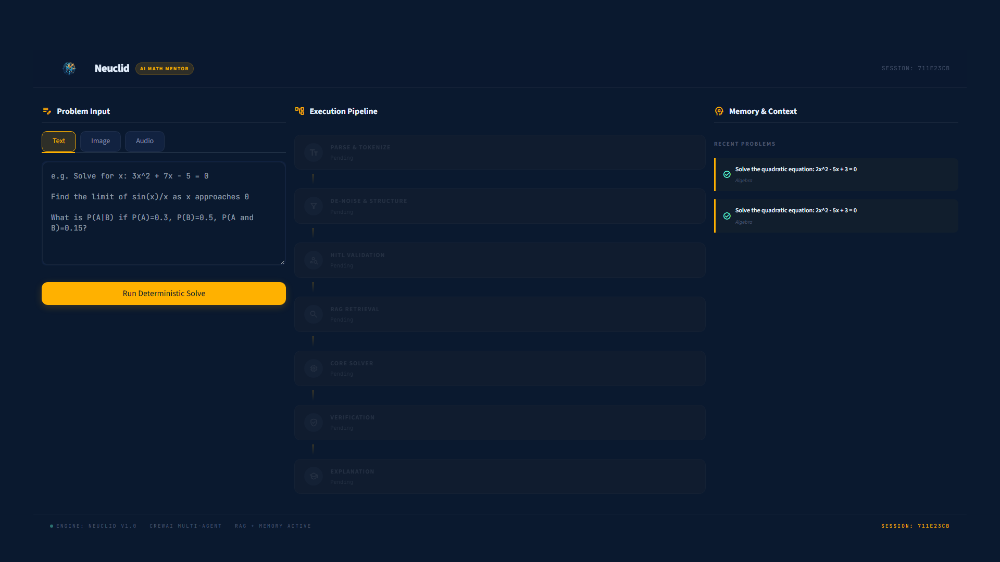
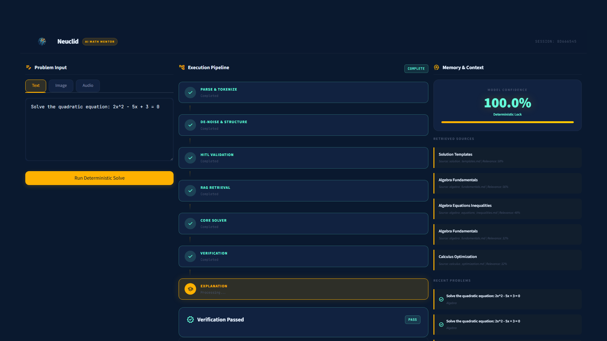
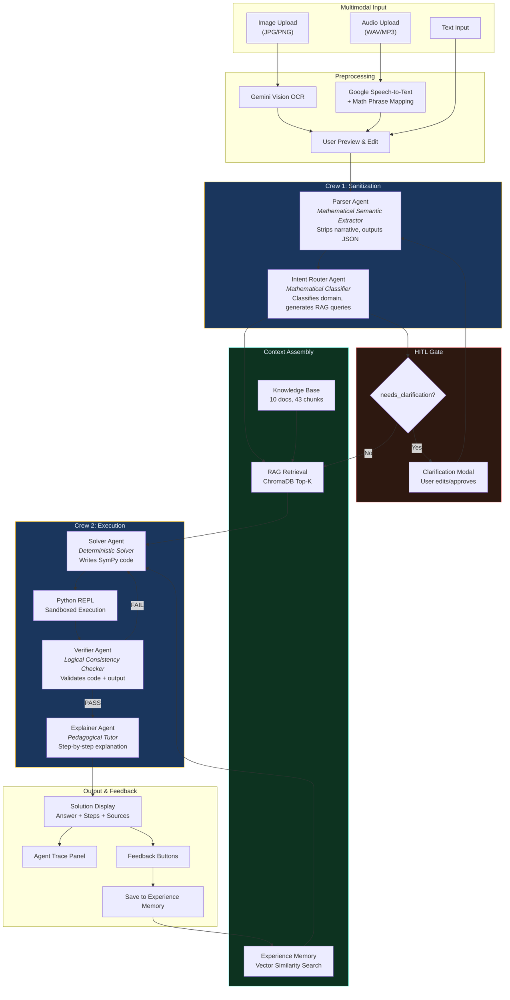
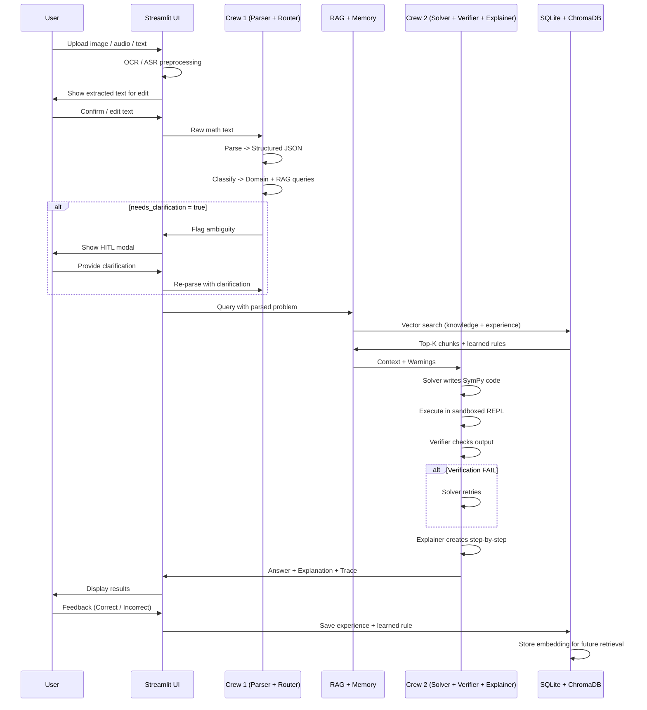
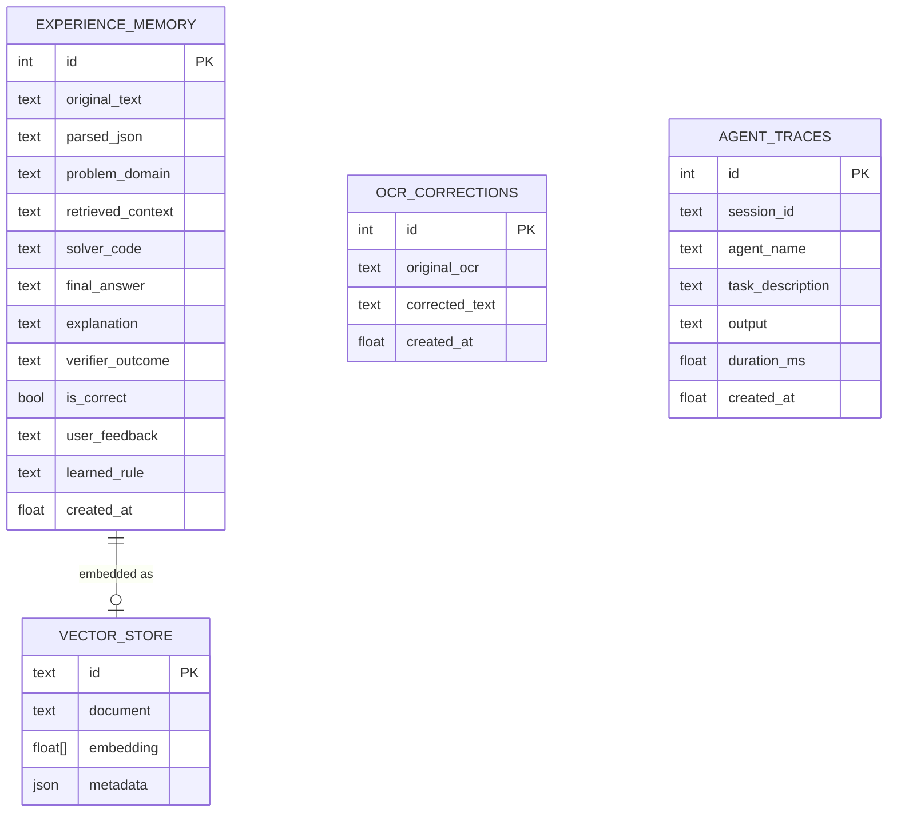

# Neuclid — Deterministic AI Math Mentor

<p align="center">
  
</p>

<p align="center">
  <strong>A reliable, multi-agent AI system that solves JEE-style math problems with deterministic computation, RAG-powered context, human-in-the-loop validation, and experience-based self-learning</strong>
</p>

<p align="center">
  
  
  
  
  
</p>

---

## Screenshots

<p align="center">
  
  <br/><em>Landing page — Dark navy UI with multimodal input (Text / Image / Audio), 7-stage pipeline visualization, and memory panel</em>
</p>

<p align="center">
  
  <br/><em>Solution view — All 7 pipeline stages completed, 100% confidence with deterministic lock, RAG sources retrieved, verification passed</em>
</p>

---

## Table of Contents

- [Problem Statement](#problem-statement)
- [Architecture](#architecture)
- [Key Design Decisions](#key-design-decisions)
- [Features](#features)
- [Edge Case Handling](#edge-case-handling)
- [Tech Stack](#tech-stack)
- [Setup & Run](#setup--run)
- [Project Structure](#project-structure)
- [How It Works](#how-it-works)
- [Evaluation Summary](#evaluation-summary)

---

## Problem Statement

Build a **Math Mentor** application that:
- Accepts math problems via **image** (OCR), **audio** (ASR), or **text**
- Parses, structures, and classifies the problem
- Solves it using **deterministic computation** (not LLM mental math)
- Verifies correctness automatically
- Explains the solution step-by-step for students
- Learns from corrections over time via experience memory

Informed by the Apple **"Illusion of Thinking"** paper, which demonstrates that LLMs fail on math when given irrelevant information or when they attempt arithmetic without tools. Neuclid enforces strict guardrails to prevent these failure modes.

---

## Architecture

### System Overview



### Two-Crew Agent Design

| Crew | Agent | Role | Key Constraint |
|------|-------|------|----------------|
| **Crew 1: Sanitization** | Parser Agent | Strips narrative, extracts pure math structure | Anti-GSM-NoOp: removes irrelevant context |
| | Intent Router | Classifies domain, generates RAG queries | Routes to correct knowledge base |
| **Crew 2: Execution** | Solver Agent | Writes Python/SymPy code for computation | **NEVER does mental math** — must use REPL |
| | Verifier Agent | Validates code logic, domain constraints | Can reject & force Solver retry |
| | Explainer Agent | Step-by-step student explanation | **NEVER mentions code** to student |

### Data Flow



### Memory & Self-Learning Schema



**Runtime Memory Flow:**
1. User submits problem -> system does vector search on `VECTOR_STORE`
2. Finds similar past problems -> checks `EXPERIENCE_MEMORY` for `learned_rule`
3. Injects warnings into Solver Agent prompt: *"WARNING - PAST EXPERIENCE: {learned_rule}"*
4. After solve, saves new experience + embedding for future retrieval

---

## Key Design Decisions

### Why Deterministic Computation?

The Apple **"Illusion of Thinking"** paper (2025) demonstrated:
- LLMs experience **complete accuracy collapse** beyond certain complexity thresholds
- Irrelevant information in prompts **destroys** math accuracy (GSM-NoOp effect)
- LLMs exhibit a **counter-intuitive scaling limit** where reasoning effort declines despite adequate token budget

**Neuclid's countermeasures:**

| Paper Finding | Neuclid Guardrail |
|---|---|
| Irrelevant info destroys accuracy | Parser Agent strips ALL narrative context |
| LLMs can't do reliable arithmetic | Solver Agent **MUST** write SymPy code, never mental math |
| Accuracy collapses at high complexity | Verifier Agent checks every output, can force retries |
| No insight into reasoning quality | Full agent trace panel shows every step |

### Why Groq + Llama 3.3 70B?

- **Speed**: Groq's LPU delivers ~500 tokens/sec, making multi-agent pipelines feel instant
- **No rate limits**: Unlike Gemini free tier (15 RPM), Groq allows smooth production use
- **Quality**: Llama 3.3 70B scores well on math benchmarks while being fast enough for real-time use
- **Gemini for Vision**: OCR still uses Gemini 2.5 Flash for its superior multimodal capabilities

### Why Two Separate Crews?

CrewAI naturally wants to run in a terminal. For Streamlit HITL, we need to **pause between crews**:
- Crew 1 runs -> produces structured JSON
- Streamlit checks `needs_clarification` -> pauses for user if needed
- RAG + Memory retrieval happens in the Streamlit layer
- Crew 2 runs with assembled context

This gives the UI full control over the flow while still leveraging CrewAI's agent orchestration.

### External Code Execution Pattern

Instead of using CrewAI's native tool-calling (which has compatibility issues across different LLM providers), the Solver Agent outputs Python code as text inside markdown code blocks. The wrapper then:
1. Extracts code blocks via regex
2. Executes them in a sandboxed Python REPL with restricted imports
3. Passes the output to the Verifier Agent

This approach is more reliable and works consistently across Groq, Gemini, and other LLM backends.

---

## Features

### Multimodal Input
- **Image**: Gemini Vision OCR with confidence scoring, user can edit extracted text
- **Audio**: Google Speech-to-Text with math-specific phrase mapping (e.g., "square root of" -> `sqrt(`)
- **Text**: Direct typed input with math notation support

### 5-Agent Multi-Agent System
- Parser, Intent Router, Solver, Verifier, Explainer
- CrewAI orchestration with sequential task execution
- Built-in retry mechanism for rate limits and transient errors

### RAG Pipeline
- 10 curated math knowledge docs covering Algebra, Calculus, Probability, Linear Algebra, Trigonometry
- 43 chunks in ChromaDB with sentence-transformer embeddings
- Top-K retrieval with relevance scoring
- Retrieved sources displayed in UI

### Human-in-the-Loop
- Triggers when: OCR/ASR confidence is low, parser detects ambiguity, verifier fails
- Modal UI with extracted variables, flagged ambiguities, clarification input
- Options: Discard, Re-scan, Resume Pipeline

### Memory & Self-Learning
- SQLite for structured experience storage
- ChromaDB for vector-based similar problem retrieval
- Learned rules injected into agent prompts as warnings
- OCR correction tracking for improved future parsing

### Premium UI
- Dark navy (#0A192F) + amber gold (#FFB100) design system
- Animated pipeline visualization (7 stages)
- Glassmorphism header with logo
- Confidence meter, agent trace panel, source chips
- CSS animations: fadeInUp, pulse-glow, scaleIn

---

## Edge Case Handling

Neuclid is designed to handle a variety of edge cases gracefully:

| Edge Case | How It's Handled |
|---|---|
| **Empty input** | Parser Agent detects empty/missing problem text and sets `needs_clarification: true`, triggering the HITL modal for user input |
| **Ambiguous problems** (e.g., "Solve x + y = ?") | Parser identifies missing constraints/information, flags ambiguity with specific reasons, and triggers HITL for clarification |
| **Irrelevant narrative context** | Parser Agent strips all non-mathematical content before solving (anti-GSM-NoOp guardrail from Apple paper) |
| **Division by zero / domain errors** | Verifier Agent checks for domain violations in the solver's code output and flags issues |
| **API rate limits (429 errors)** | All agent crews have built-in retry logic with exponential backoff (`time.sleep(10 * (attempt + 1))`) up to 3 retries |
| **Empty LLM responses** | Detected and retried automatically; if all retries fail, a descriptive error is returned to the user |
| **Code execution failures** | Sandboxed REPL catches exceptions and returns error messages; Verifier can request a retry from the Solver |
| **Malicious code injection** | Python REPL uses restricted `__builtins__` with a custom `_safe_import()` that only allows math-related modules (sympy, math, fractions, decimal, itertools) |
| **OCR/ASR low confidence** | Preprocessing step shows extracted text to user for review and editing before pipeline runs |
| **Multiple valid solutions** | Solver outputs all solutions (e.g., both roots of a quadratic); Explainer presents them clearly |
| **Irrational/complex answers** | Solver outputs both symbolic form and numerical approximation using `float()` |
| **Previously seen similar problems** | Experience memory retrieves learned rules from past problems and injects them as warnings into the Solver prompt |

### Sandboxed Execution Security

The Python REPL is hardened against arbitrary code execution:

```python
_ALLOWED_IMPORT_NAMES = {"sympy", "math", "fractions", "decimal", "itertools", "functools", "collections"}

def _safe_import(name, globals=None, locals=None, fromlist=(), level=0):
    base = name.split(".")[0]
    if base not in _ALLOWED_IMPORT_NAMES:
        raise ImportError(f"Import of '{name}' is not allowed.")
    return __import__(name, globals, locals, fromlist, level)
```

Dangerous builtins like `exec`, `eval`, `open`, `__import__` are replaced with safe alternatives or removed entirely.

---

## Tech Stack

| Component | Technology |
|---|---|
| **LLM (Agents)** | Groq / Llama-3.3-70B-Versatile |
| **LLM (Vision/OCR)** | Google Gemini 2.5 Flash |
| **Agent Framework** | CrewAI + LiteLLM |
| **UI** | Streamlit |
| **Vector Store** | ChromaDB |
| **Embeddings** | sentence-transformers (all-MiniLM-L6-v2) |
| **Memory Database** | SQLite |
| **Math Solver** | SymPy (sandboxed Python REPL) |
| **ASR** | Google Speech Recognition |
| **Language** | Python 3.12 |

---

## Setup & Run

### Prerequisites
- Python 3.10+
- Groq API key ([Get one free](https://console.groq.com))
- Google Gemini API key ([Get one free](https://aistudio.google.com/apikey))

### Installation

```bash
# Clone the repo
git clone https://github.com/KishoreMuruganantham/neuclid.git
cd neuclid

# Create virtual environment (recommended)
python -m venv venv
source venv/bin/activate  # On Windows: venv\Scripts\activate

# Install dependencies
pip install -r requirements.txt

# Configure API keys
cp .env.example .env
# Edit .env with your API keys
```

### Run

```bash
streamlit run app.py
```

Open `http://localhost:8501` in your browser.

### Environment Variables

| Variable | Description | Required |
|---|---|---|
| `GROQ_API_KEY` | Groq API key for LLM agents | Yes |
| `GOOGLE_API_KEY` | Google API key for Gemini Vision OCR | Yes |
| `LLM_MODEL` | CrewAI model string (default: `groq/llama-3.3-70b-versatile`) | No |
| `GEMINI_VISION_MODEL` | Gemini model for OCR (default: `gemini-2.5-flash`) | No |

---

## Project Structure

```
neuclid/
├── app.py                          # Streamlit UI (main entry point)
├── config.py                       # Configuration & environment variables
├── requirements.txt                # Python dependencies
├── .env.example                    # Environment variable template
├── .streamlit/config.toml          # Streamlit theme configuration
├── LogoBg removed.png              # App logo
│
├── agents/                         # CrewAI agent definitions
│   ├── crew1_sanitization.py       # Crew 1: Parser + Intent Router
│   └── crew2_execution.py          # Crew 2: Solver + Verifier + Explainer
│
├── tools/                          # Agent tools
│   ├── python_repl.py              # Sandboxed SymPy code execution
│   ├── ocr_tool.py                 # Gemini Vision OCR
│   └── asr_tool.py                 # Speech-to-text with math phrases
│
├── rag/                            # Retrieval-Augmented Generation
│   ├── embeddings.py               # ChromaDB vector store builder
│   ├── retriever.py                # RAG query engine
│   └── knowledge_base/             # Curated math knowledge (10 docs)
│       ├── algebra_fundamentals.md
│       ├── algebra_equations_inequalities.md
│       ├── calculus_limits.md
│       ├── calculus_derivatives.md
│       ├── calculus_optimization.md
│       ├── probability.md
│       ├── linear_algebra.md
│       ├── trigonometry.md
│       ├── common_mistakes.md
│       └── solution_templates.md
│
└── memory/                         # Experience-based learning
    ├── db.py                       # SQLite schema & CRUD operations
    └── vector_memory.py            # Vector similarity search for past problems
```

---

## How It Works

### Example: "Find the limit of sin(x)/x as x approaches 0"

**Step 1 — Parser Agent** strips context, outputs:
```json
{
  "problem_text": "lim(x->0) sin(x)/x",
  "topic": "Calculus",
  "subtopic": "Limits",
  "variables": ["x"],
  "constraints": [],
  "objective": "Evaluate the limit",
  "needs_clarification": false
}
```

**Step 2 — Intent Router** classifies as `Calculus - Limits`, generates RAG queries.

**Step 3 — RAG** retrieves relevant chunks about standard limits, L'Hopital's rule.

**Step 4 — Memory** checks for past similar problems, injects any learned rules.

**Step 5 — Solver Agent** writes and executes:
```python
from sympy import symbols, limit, sin
x = symbols('x')
result = limit(sin(x)/x, x, 0)
print(f"The limit is: {result}")  # Output: 1
```

**Step 6 — Verifier Agent** confirms the output is correct, confidence: 1.0

**Step 7 — Explainer Agent** produces:
> [Step 1] We need to evaluate lim(x->0) sin(x)/x.
> [Step 2] This is a standard limit. Direct substitution gives 0/0 (indeterminate).
> [Step 3] By the standard limit identity: lim(x->0) sin(x)/x = 1.
> **Final Answer: 1**

---

## Evaluation Summary

### Assignment Requirements Coverage

| # | Requirement | Status | Implementation |
|---|---|---|---|
| 1 | Multimodal Input (Image/Audio/Text) | Done | Gemini Vision OCR + Google ASR + Text input |
| 2 | Parser Agent | Done | Strips narrative, outputs structured JSON |
| 3 | RAG Pipeline | Done | 10 docs, 43 chunks, ChromaDB, top-K retrieval |
| 4 | Multi-Agent System (5+ agents) | Done | Parser, Router, Solver, Verifier, Explainer |
| 5 | Application UI | Done | Streamlit with premium dark theme |
| 6 | Human-in-the-Loop | Done | Triggers on ambiguity/low confidence |
| 7 | Memory & Self-Learning | Done | SQLite + ChromaDB vector memory |
| 8 | GitHub Repo + README | Done | This document |

### Agent Performance

| Agent | Purpose | Avg Response Time (Groq) |
|---|---|---|
| Parser | Extract math structure | ~2s |
| Intent Router | Classify domain | ~1.5s |
| Solver | Write & execute SymPy | ~4s |
| Verifier | Validate correctness | ~3s |
| Explainer | Step-by-step explanation | ~3s |
| **Full Pipeline** | **End-to-end** | **~15-20s** |

### Math Domain Coverage

| Domain | Topics Covered | Knowledge Base Docs |
|---|---|---|
| Algebra | Quadratic equations, inequalities, factoring, logarithms, AP/GP | 2 |
| Calculus | Limits (standard, L'Hopital), derivatives, optimization | 3 |
| Probability | Bayes' theorem, combinations, distributions, expected value | 1 |
| Linear Algebra | Matrices, determinants, eigenvalues, systems of equations | 1 |
| Trigonometry | Identities, inverse trig, double/half angle formulas | 1 |
| Cross-cutting | Common mistakes, solution templates | 2 |

### Key Strengths

1. **Deterministic computation** — Solver MUST use SymPy, preventing LLM arithmetic hallucinations
2. **Anti-hallucination guardrails** — Parser strips irrelevant context (counters GSM-NoOp)
3. **Self-learning** — Past mistakes are stored and injected as warnings for future problems
4. **Fast inference** — Groq LPU delivers sub-second agent responses
5. **Sandboxed execution** — Restricted Python REPL prevents code injection attacks
6. **Graceful error handling** — Retry logic, HITL fallbacks, and descriptive error messages

### Known Limitations

1. **Math scope** — Limited to JEE-level algebra, calculus, probability, linear algebra
2. **OCR accuracy** — Handwritten math recognition depends on handwriting clarity
3. **Audio** — Math-specific phrases need to match the replacement dictionary
4. **Verification** — The Verifier relies on LLM reasoning, not formal proof verification

---

## License

MIT

---

<p align="center">
  Built with CrewAI, Groq, and Streamlit<br/>
  <strong>Neuclid</strong> — Neural + Euclid
</p>
